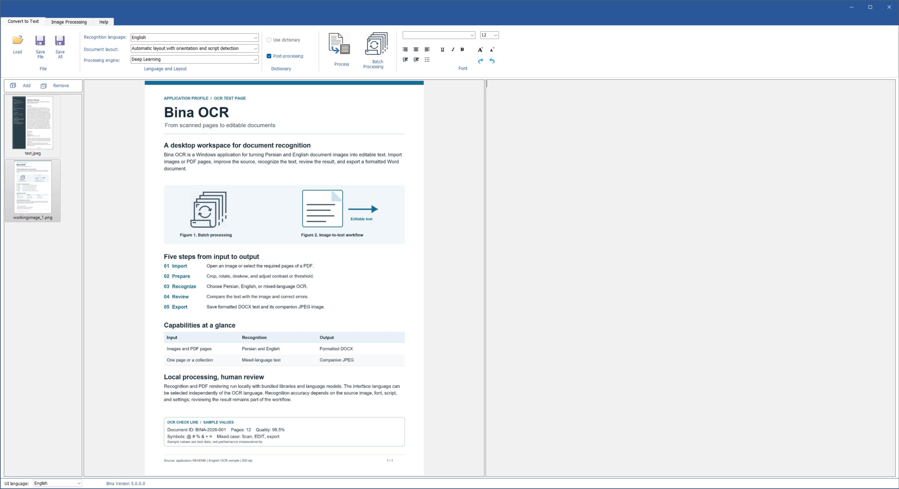
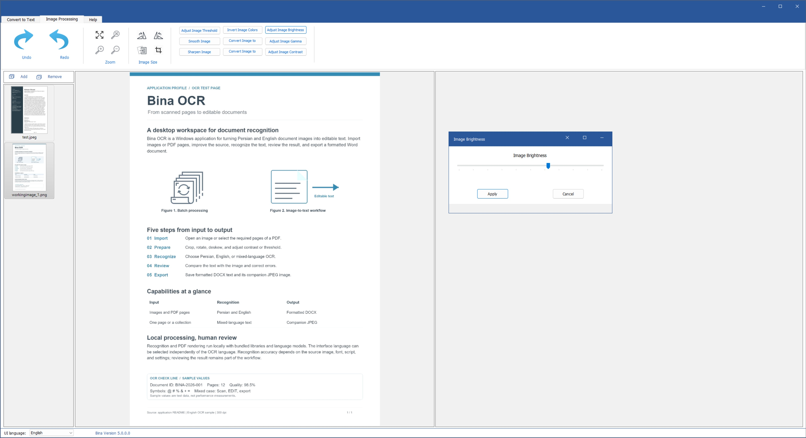

# Bina OCR

**Turn Persian and English document images into editable, formatted Word documents.**

Bina OCR is a Windows desktop workspace for the complete recognition process: import a document, improve its image, extract the text, review the result, and export your work. It brings image preparation and a rich text editor into one interface, so you can work from a scanned page to a reusable document without moving between separate tools.

Built around Persian, English, and mixed-language recognition, Bina combines bilingual controls with practical tools for document work. Recognition and PDF rendering run locally using bundled native libraries and language models; the document-processing workflow does not require a cloud OCR service.

## Project history and modernization

Bina OCR was originally developed about eight years ago, around 2018, using .NET Framework 4.5. This repository modernizes that desktop application for .NET 10 while preserving its core recognition, image preparation, and editing workflow.

As part of preparing the project for open-source distribution, we removed the desktop activation mechanism, including activation dialogs, hardware fingerprinting, and license-manager dependencies. Components that we could not make open source have been removed or replaced. Third-party copyright notices and license terms remain in place. See [CHANGELOG.md](CHANGELOG.md) for details of the removals, replacements, migration, and other improvements.

## Screenshots

### Recognition and text editing

The main desktop workspace combines imported page thumbnails, a source-image preview, recognition settings, and a text editor for reviewing and formatting OCR results.



### Image improvement and adjustment

The Image Processing tab provides image preparation tools, including rotation, cropping, smoothing, sharpening, and brightness, contrast, gamma, and threshold adjustments. The screenshot shows the brightness adjustment dialog.



## Features

| Capability | What you can do |
| --- | --- |
| **Persian, English, and mixed-language OCR** | Choose the recognition model for Persian text, English text, or documents containing both. Select the interface language independently of the document language. |
| **Image and PDF input** | Import multiple image files, load all pages of a PDF, or select the pages you need. A thumbnail workspace keeps the imported images and PDF pages accessible for review. |
| **Image preparation** | Crop unwanted areas, rotate pages, correct skew, sharpen text, smooth noise, invert colors, or convert to grayscale and monochrome. Adjust brightness, contrast, gamma, and threshold with live previews before applying changes. |
| **Recognition controls** | Match recognition to the source with page segmentation options for automatic analysis, text blocks, columns, individual lines, sparse text, words, and characters. Available OCR engine options follow the selected language. |
| **Single-page and batch processing** | Recognize the selected image or process the imported collection sequentially. See which image is being processed and cancel queued work while the current native recognition call finishes safely. |
| **Rich text review** | Correct recognition results and apply font families, sizes, bold, italic, underline, paragraph alignment, bullets, and indentation. Each image retains its own edited text, formatting, and text direction as you move through the collection. |
| **Formatted Word export** | Save the current image's result or export the collection. DOCX output carries the edited text and supported formatting; a companion JPEG preserves the corresponding prepared image. Existing output names receive numbered suffixes to protect earlier exports. |
| **English and Persian interface** | Switch labels, messages, and layout between English and Persian, including right-to-left presentation. Image adjustment dialogs use the shared application header and identify the active adjustment. |
| **Inspection and reversible image edits** | Zoom in, zoom out, view actual size, or fit the image to the workspace. Undo and redo image preparation steps while comparing the source with its recognized text. |
| **Optional Persian text cleanup** | Enable post-processing to apply the bundled Persian text cleanup rules after recognition, then review and refine the result in the editor. |

## A practical document workflow

1. **Bring in the source.** Load one or more images, or choose the relevant pages of a PDF. Use the thumbnails to move between documents and pages.
2. **Prepare the page.** Inspect it at a useful zoom level, crop the reading area, correct orientation or skew, and adjust image contrast or threshold where needed. Preview slider adjustments before committing them.
3. **Choose how to recognize it.** Select Persian, English, or mixed recognition and a segmentation mode suited to the page. The language of the interface can remain whatever you prefer.
4. **Recognize and review.** Process one image or the collection, compare the output with the source, correct errors, and format the text for its intended use. Edits stay associated with the corresponding image throughout the session.
5. **Export the finished work.** Write a formatted Word document and its companion image, or export the imported collection to a chosen directory.

This workflow is useful for reusing text from scanned correspondence, printed reports, study material, and bilingual documents. Its strength is the combination of recognition, image preparation, and human review: you can inspect the source, correct the result, and shape the exported document in one workspace.

DOCX formatting reflects the recognized text and the edits made in Bina's editor. PDF pages are rendered as images for recognition, and collection export creates separate outputs for each imported image or page. Recognition quality depends on the source image, script, font, and selected settings; reviewing the text remains part of the workflow. Image and editor state are maintained within the current session.

See [CHANGELOG.md](CHANGELOG.md) for development history and notes for the next release.

## Third-party attribution and licensing

`DSP.Khana.Ocr.Engine.v5` is a modified copy of [Charles Weld's Tesseract .NET wrapper](https://github.com/charlesw/tesseract), licensed under **Apache-2.0**, incorporating [Andrey Akinshin's InteropDotNet](https://github.com/AndreyAkinshin/InteropDotNet), licensed under **MIT**. Copyright 2012-2022 Charles Weld; Copyright (c) 2014 Andrey Akinshin.

The engine uses the upstream namespaces and type names, with local requirements documented in its [README](DSP.Khana.Ocr.Engine.v5/README.md). See [THIRD-PARTY-NOTICES.md](THIRD-PARTY-NOTICES.md) and the full license texts in [LICENSES](LICENSES). Attribution is also shown in the English and Persian About dialogs, and the notice and license files accompany build and publish output.

DOCX export uses [Open XML SDK](https://github.com/dotnet/Open-XML-SDK) 3.5.1 by the .NET Foundation and contributors under MIT. Its full license is included in `LICENSES/OpenXmlSdk-MIT.txt`.

These notices cover the managed OCR and DOCX components. A license for independently authored application code has not yet been selected, and the remaining bundled dependencies and assets need separate license review before publishing the complete solution as open source.

## Build and run

The `DSP.Khana.Ocr.New` solution contains the desktop application and its five supporting projects. Application namespaces and project names are preserved, including the original `Wapper` spelling; the managed OCR engine uses the upstream Tesseract namespaces. Desktop builds use the license-free profile; activation and licensing projects are not required.

### Prerequisites

- Windows and the **.NET 10 SDK**. `global.json` selects a stable .NET 10 SDK and allows newer .NET 10 feature bands.
- For Visual Studio, use **Visual Studio 2026** with the .NET desktop development workload. Visual Studio 2022 does not provide the .NET 10 development toolchain.
- For framework-dependent deployment, install the **.NET 10 Desktop Runtime** on the target machine.

Open [DSP.Khana.Ocr.sln](DSP.Khana.Ocr.sln) and set **DSP.Bina.Ocr.DesktopApplication.V3** as the startup project. All six application projects use SDK-style project files. The post-processing library targets `net10.0`; the desktop and its Windows-dependent libraries target `net10.0-windows`.

From PowerShell in the solution directory:

```powershell
dotnet restore DSP.Khana.Ocr.sln
dotnet build DSP.Khana.Ocr.sln -c Debug
dotnet build DSP.Khana.Ocr.sln -c Release
dotnet run --project DSP.Bina.Ocr.DesktopApplication.V3 -c Debug
```

NuGet dependencies use `PackageReference` and restore into the standard user cache. No legacy `packages/` folder or .NET Framework targeting pack is needed. Keep the native DLLs, embedded OCR model archives, and resource images checked in.

## Migration checks

Run the integration smoke checks on Windows with:

```powershell
dotnet run --project tests/SmokeTests/SmokeTests.csproj -c Release
```

The checks exercise all 285 English/Persian resource lookups, DOCX export and reload, Open XML schema validation, real native OCR with the English/Persian/mixed models, the production OCR wrapper and post-processing, native PDF rendering, production form initialization, live About Us translations, batched RTL/LTR switching, adjustment dialog headings and Apply/Cancel behavior in both languages, and resizing. The test forms are transparent and close automatically. As during normal recognition and PDF import, the production wrapper extracts its runtime assets into the user's application-data folder. Test samples use a unique temporary folder; Windows can retain loaded native DLLs there until the process exits.

## How the application works

1. **Startup:** [Program.cs](DSP.Bina.Ocr.DesktopApplication.V3/Program.cs) initializes WinForms, registers UI exception handling, creates `MainForm`, and enters the Windows message loop.
2. **OCR initialization:** `OcrService` initializes `BinaOcr.Instance()` on the first recognition request. PDF import also initializes the wrapper before rendering. The wrapper extracts the embedded native OCR libraries and trained language models, selecting native binaries for the current process architecture.
3. **Input:** The user imports images or selected PDF pages. `PDFConvert` renders PDF pages to image files through the `DSP.Tools32.dll` / `DSP.Tools64.dll` Ghostscript API. `ImageEntity` holds each image and its associated application state; `ImageListView` presents the image list.
4. **Image preparation:** The desktop uses `DSP.Khana.ImageTools` for operations such as image adjustment and deskew. Preparing an image can improve recognition before it reaches the OCR engine.
5. **Recognition:** The form passes the selected image and a snapshot of OCR options to `OcrService`, which serializes calls to `BinaOcr`. The wrapper maps those options to the managed engine, which calls the native OCR library. Optional post-processing applies text cleanup rules to the recognized result.
6. **Editing and export:** Text edits, RTF formatting, and text direction are stored per image and restored when selection changes. `RichTextDocumentService` captures font family/size, bold, italic, underline, color, paragraph alignment, bullets, indentation, and direction. `DocumentExportService` writes that snapshot as DOCX using Open XML SDK and saves the image as JPEG. Existing base filenames receive ` (2)`, ` (3)`, and subsequent suffixes; exclusive file creation prevents accidental overwrites. The completion message shows the actual export name or output directory.
7. **UI language:** The footer language selector switches resource strings and directional layout between English and Persian. It also refreshes the About Us dialog when open.

Changing the **UI language** changes labels, messages, and arrangement. The separate **OCR language** option selects the recognition model: Persian, English, or mixed. The current UI selection is not saved as a persistent user preference; startup chooses from the thread's UI culture.

## Recognition cancellation and resource ownership

Only one recognition run can be started per form, and a shared service gate permits only one native call across forms. Import, editing, export, and image selection are disabled during recognition. The footer offers a Cancel OCR button. Cancellation stops queued work and prevents a canceled result from replacing text; the native engine cannot interrupt a page already in progress, so that page is allowed to finish before its owned snapshot is disposed. Closing the form requests cancellation and waits for active recognition before releasing resources.

`ImageEntity` owns its current bitmap and a bounded undo/redo history. Evicted entries, discarded redo states, and all remaining images are disposed when no longer needed. Imported bitmaps are detached from their source files. The thumbnail cache receives a separate, small image so disposing an editable image does not invalidate its thumbnail. Adjustment previews are replaced and disposed as the slider moves and when the dialog closes. Form closure or disposal releases the image list, entities, temporary session directory, and owned editor font.

For the focused deterministic regression checks, run:

```powershell
dotnet run --project tests/SmokeTests/SmokeTests.csproj -c Debug -- --refactoring-only
```

The focused checks cover image ownership, unlocked imported files, formatted export and collision preservation, per-image edited text/RTF, serialized OCR calls, cancellation, failure recovery, and closing while OCR is active. The full smoke suite also runs native OCR, PDF conversion, and live bilingual layout checks.

## Why each project is included

| Project | Responsibility | Why the desktop needs it |
| --- | --- | --- |
| `DSP.Bina.Ocr.DesktopApplication.V3` | Application entry point, forms, image state, editor, export commands, and localization. | This is the executable and the user interface that coordinates the workflow. |
| `DSP.Khana.Image.Tools` (`DSP.Khana.ImageTools.csproj`) | Image conversion, image adjustment, deskew, and PDF rendering helpers. | Input preparation and PDF-to-image conversion are used by the desktop before recognition. |
| `DSP.Khana.Ocr.Wapper` | The `BinaOcr` facade, option mapping, native/model extraction, recognition calls, and optional cleanup. | Provides the desktop's OCR API and manages the assets needed by the engine. |
| `DSP.Khana.Ocr.Engine.v5` | Managed OCR engine, image/page objects, and native interop. | Bridges the C# wrapper to the native OCR and Leptonica libraries. The Windows-dependent engine now targets `net10.0-windows`; its bitmap conversion and native interop remain available. |
| `DSP.Khana.Ocr.PostPRocessing` (`DSP.Khana.Ocr.PostProcessing.csproj`) | Text cleanup rules for spacing, line breaks, and word filtering. | Required by the wrapper's optional post-processing path. |
| `OtherUsefulLibrary/ImageListView` | WinForms image-list control, thumbnail caching, selection, and rendering. | Displays imported images and PDF pages and lets the user select them for editing and recognition. |

The direct project dependencies are:

```text
DSP.Bina.Ocr.DesktopApplication.V3
├── DSP.Khana.ImageTools
├── Bina.Ocr.Wapper
│   ├── DSP.Khana.Ocr.Engine.v5
│   └── DSP.Khana.Ocr.PostProcessing
└── ImageListView
```

## Important source files and assets

| Part | Purpose and reason to retain it |
| --- | --- |
| [Directory.Build.props](Directory.Build.props) | Shared .NET 10 target and build settings, platform metadata, preserved assembly attributes, and the `DESKTOP_WITHOUT_LICENSING` constant. Projects built directly also exclude guarded licensing code. |
| [global.json](global.json) | Keeps CLI builds on the .NET 10 SDK rather than accidentally selecting an older SDK. |
| `tests/SmokeTests/` | Reproducible migration integration checks using the actual assemblies, native libraries, models, and forms. |
| `Forms/MainForm.cs` | Main form behavior: image import, editing, recognition, text formatting, and export. |
| `Forms/MainForm.Designer.cs` and `.resx` | WinForms-generated controls, initial layout, and designer resources. These are part of the form and must accompany its behavior file. |
| `Forms/MainForm.Localization.cs` | Creates the footer language selector, applies `Properties.Strings`, and refreshes language-dependent controls and open About Us windows. |
| `Forms/MainForm.Layout.cs` | Applies RTL/LTR layout and alignment changes, including control arrangements and resizing. Translated text alone cannot rearrange the original Persian layout. |
| `Forms/MainForm.Workflows.cs` | Coordinates OCR busy/cancel/close state, per-image editor persistence, adjustment preview ownership, and lifetime cleanup. |
| `Services/ImageImportService.cs` | Loads detached bitmaps, renders PDF pages into a private session directory, and cleans up temporary files. |
| `Services/ImageEditService.cs` | Performs image operations and creates previews; temporary images are disposed after committing or canceling an edit. |
| `Services/OcrService.cs` | Takes an owned bitmap snapshot, serializes native OCR calls, and implements cooperative cancellation. Its interface allows deterministic workflow tests without native OCR. |
| `Services/RichTextDocumentService.cs` and `Model/DocumentSnapshot.cs` | Convert saved RTF into paragraph/run formatting suitable for DOCX export without modifying the visible editor. |
| `Services/DocumentExportService.cs` | Produces formatted DOCX/JPEG pairs, chooses collision-free names, and creates new files exclusively. |
| `Services/ApplicationErrorService.cs` | Maps validation and typed filesystem errors to localized messages and records diagnostic details in the local error log. |
| `Forms/AboutUsForm.*`, `Forms/PdfPageSelectionForm.*`, and `Forms/BaseDialogForm.*` | Supporting dialogs and shared form presentation used by the desktop. Their designer and resource files belong with the C# files. |
| `Controls/ScrollablePictureBox.*` and `Forms/TrackBarDialog.*` | Supporting WinForms controls/dialogs for image presentation and adjustment. |
| `Model/` | Image state, selection-related values, undo/history support, and application-specific exceptions. Keeps form operations and error handling consistent. |
| `Properties/Strings.resx` | Neutral English strings and fallback translations. |
| `Properties/Strings.fa-IR.resx` | Persian translations using the same keys as the neutral resource file. Built into a `fa-IR` satellite assembly. |
| `Properties/Strings.Designer.cs` | Strongly typed `Properties.Strings` accessors used by application code. Regenerate it when resource keys change. |
| `Properties/Resources.*` and `Resources/` | Embedded UI images and icons referenced by forms. Resource file references must remain valid. |
| `Properties/Settings.*`, `Properties/AssemblyInfo.cs`, and `App.config` | Existing settings infrastructure, assembly metadata, and application configuration. |
| `DSP.Khana.Ocr.Wapper/Properties/Data.zip` | Embedded OCR data. The wrapper's archive supplies trained models, including the English, Persian, and mixed-language models used by the UI. Without model data, the engine cannot recognize text. The desktop references the wrapper instead of embedding duplicate archives or native libraries. |
| Native DLLs embedded from the wrapper's `Properties/` folder | Architecture-specific OCR, Leptonica, and PDF helper binaries. The wrapper extracts them when OCR or PDF import initializes it, so they also travel inside its DLL when publishing. They are source dependencies, not disposable build output. |
| Third-party license notices | Attribution and license terms for bundled third-party code. Removing desktop activation does not remove these notices. |

Paths in the source-file table are relative to the desktop project unless they explicitly name another project.

## NuGet dependencies and removed legacy packages

| Dependency | Why it is needed |
| --- | --- |
| `System.Drawing.Common` 10.0.12 | Bitmap, font, image conversion, and graphics APIs used by the OCR, image-tool, wrapper, and desktop export. These operations remain Windows-only. |
| `DocumentFormat.OpenXml` 3.5.1 (MIT) | DOCX generation and typed document APIs. Its Framework dependency supplies package support through `System.IO.Packaging`. |
| .NET 10 Windows Desktop framework | WinForms, designer APIs, resources, and configuration APIs used by the executable and image-list control. These are provided by `UseWindowsForms`; redundant package references are not needed. |

The old App Center, Newtonsoft.Json, SQLite/SQLitePCLRaw, and RuntimeInformation assembly references and imported targets were removed. SQLite and Newtonsoft.Json had no active source usage in this copied desktop workflow; RuntimeInformation is supplied by modern .NET. App Center startup and crash reporting were replaced with local error logging to `%LOCALAPPDATA%\DSP.Khana.Ocr\Logs\errors.log`. The old `packages.config` and bundled legacy package cache are no longer part of the solution.

The OCR engine's dynamic native interop now uses `AssemblyBuilder.DefineDynamicAssembly`, supported by modern .NET. WinForms control properties explicitly declare their designer serialization behavior to satisfy .NET 10's checks while keeping the image-list designer integration.

## Runtime files and deployment

The desktop build output is:

```text
DSP.Bina.Ocr.DesktopApplication.V3/bin/Debug/net10.0-windows/
DSP.Bina.Ocr.DesktopApplication.V3/bin/Release/net10.0-windows/
```

Run or distribute the **complete desktop output folder**, including its managed dependencies, `.deps.json`, `.runtimeconfig.json`, `fa-IR` satellite resource folder, and native subfolders. Copying only the `.exe` omits required files. A framework-dependent build needs the .NET 10 Desktop Runtime on the target machine.

The wrapper extracts OCR libraries and language models under `%APPDATA%\.temporalapp`, using version-specific `.app_<version>` and `.model_<version>` directories. It also writes the appropriate `DSP.Tools32.dll` or `DSP.Tools64.dll` beside the executable. The application therefore needs write access to its executable directory as well as the user's application-data directory under the current implementation. PDF conversion creates rendered page images in a unique session directory under `%TEMP%\DSP.Khana.Ocr`.

Libraries build into `bin/<Configuration>/<TargetFramework>/`; project references copy their required output into the desktop folder.

To create a self-contained x64 release that includes the .NET runtime:

```powershell
dotnet publish DSP.Bina.Ocr.DesktopApplication.V3 -c Release -r win-x64 --self-contained true -o publish/win-x64
```

Publish the complete folder. Keep trimming and Native AOT disabled: the application uses WinForms resources, reflection, and dynamically emitted OCR interop. The bundled native libraries support x86/x64; ARM64 deployment is not covered by these assets.

## Working on localization

Add matching keys to `Strings.resx` and `Strings.fa-IR.resx`, regenerate `Strings.Designer.cs`, and bind UI text through `Properties.Strings`. Update `MainForm.Localization.cs` for new controls and `MainForm.Layout.cs` when a control needs direction-specific placement or alignment. Keep the footer selector on the left and refresh both languages when checking dialogs and resize behavior.

